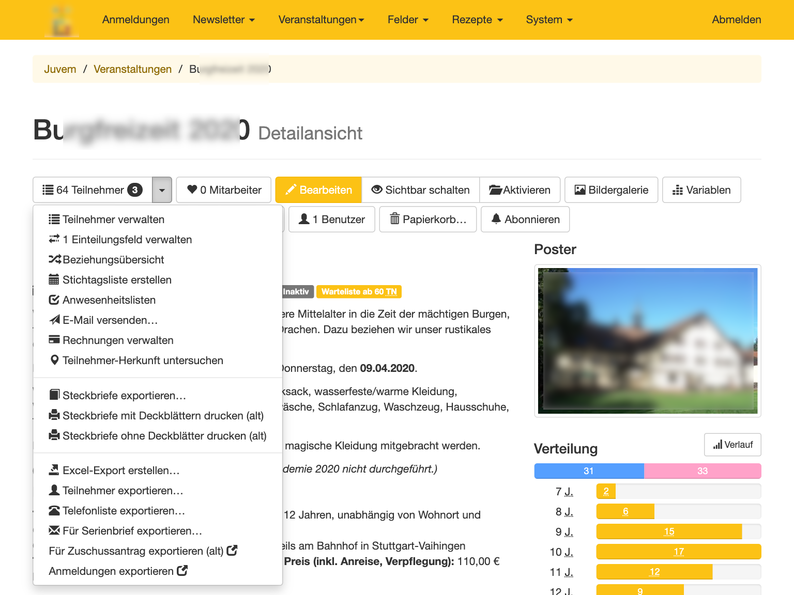
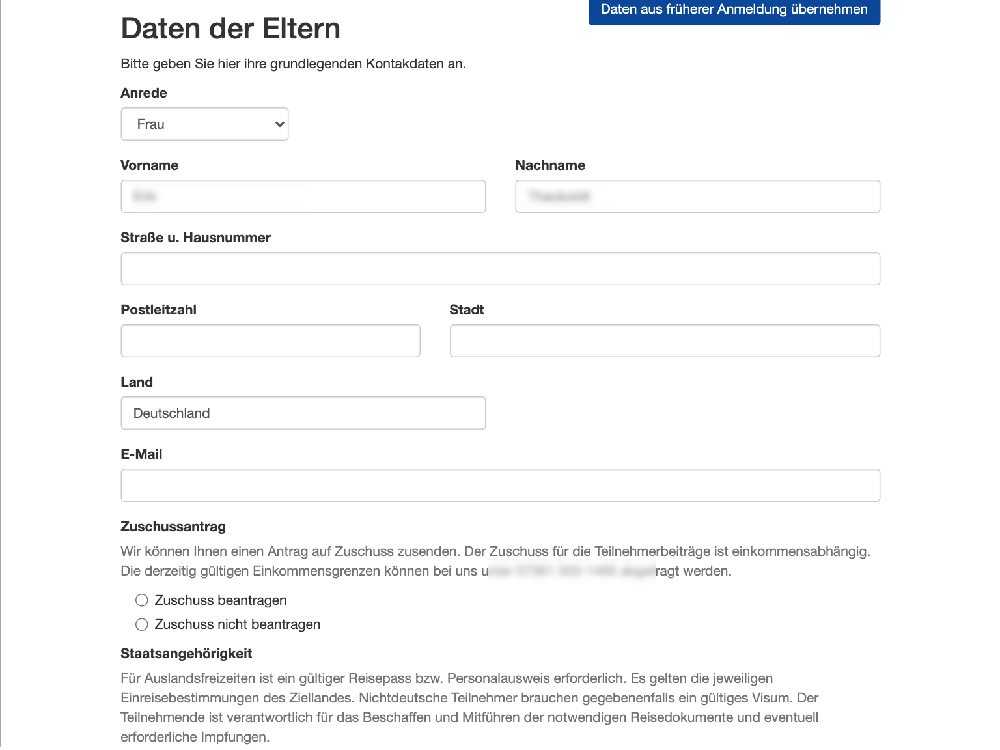

# JUVEM
Juvem is a symfony based web application to manage events and newsletters.

 

## Features

### Events
Create events so that people can request participation on them. Originally *Juvem* was created to make parents able to register their kids for participation on special events, but can be used for regular events as well.

#### Participation handling
Participations can be confirmed, withdrawn or rejected. It is also possible to enable auto-confirmation for events if you do not want to confirm one by one.

Juvem is able to send emails when somebody requested for participation and when a participation is confirmed. Administrators can also send emails to all participants of an event.

Create excel exports containing participant lists and write emails which are sent to all participants.

Create and handle attendance lists, check attendance on multiple devices at the same time.

Add notes or comments to participations or participants to share information with your colleagues.

#### Custom fields
Beside the default fields like name, age or phone numbers you can define your own fields to be acquired on each participation requests. Those fields can be of type text or selection (single/multiple). You enable those fields on each event you want to acquire this data.

### Newsletter
People can register themselves in order to receive the newsletter. For each newsletter, you have to define an age range specifying for people of which age this newsletter is directed to. People can select the age range they want to be notified about.

Presents your events on homepage, providing more information for logged in admins

A lot of things to do in event details for admin, providing lists, statistics, exports, weather data...

Public participation form, providing autofill for registered users

See how early participants register for events

Detect dependencies between participants, easily distribute them in groups

Create customized excel export 

Create custom fields to ask parents for special data

Configure formulas calculating participation price depending on chosen options when participating

Create newsletters

Manage participation prices and payments

## Requirements
Juvem is a symfony 4.4 based application.

### Production
* PHP 8.1
* MySQL/MariaDB InnoDB database
* ~ 175 MB disk space (including dependencies)

### Development/Deployment
* PHP 8.1
* MySQL/MariaDB InnoDB database
* Npm/Grunt for css/js deployment, having `grunt-cli` installed globally
* Having sass gem installed
* ~ 225 MB disk space (including dev/deployment dependencies, node modules)

## Installation and deployment
* Checkout project
* Navigate into project folder
* Install PHP composer dependencies with `composer install`. If you did not configure configs parameters.yml file before, you may be asked now to do so.
* Setup database by executing `./app/console doctrine:schema:create`
* If `grunt-cli` is not yet installed, install it via `npm install -g grunt-cli`
* If sass gem is not yet installed, install it via `gem install sass`
* Install npm dependencies with `npm install`
* In order to have CSS and JS build, you need to execute grunt task `grunt deploy`

